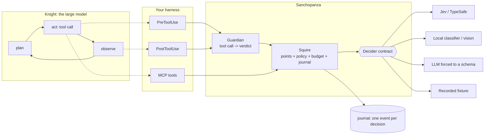

<div align="center">


# Sanchopanza

**A calibrated, non-generative decision layer for LLM agent harnesses.**

[](https://pypi.org/project/sanchopanza/)
[](https://pypi.org/project/sanchopanza/)
[](LICENSE)
[](https://github.com/romanpert/sancho/actions/workflows/ci.yml)
[](docs/paper.md)

*The knight thinks. The squire reads.*

</div>

---

## The idea in one paragraph

An agent takes two kinds of decision. The **substantive** ones, what to investigate, what the
evidence means, how to write it up, are what you pay the large model for. The **procedural**
ones, which model size this subtask deserves, whether this search repeats an earlier one,
whether this page is worth reading, whether this citation holds, whether this shell command
is safe, happen dozens to hundreds of times per job, get paid at the large model's price, and
leave no trace of why they were taken. Sanchopanza moves those to a model that returns a
typed choice, a scale position or a probability, **never text**, at 29 millionths of a dollar
and a quarter of a second. It attaches through the hooks and tools your harness already has.

```bash
pip install sanchopanza[jev]     # TypeSafe Jev over HTTP
pip install sanchopanza[mcp]     # expose the decision points as MCP tools
pip install sanchopanza          # core only: recorded, null, local and LLM providers
```

Distribution, import and command are all `sanchopanza`; `sancho` is a short alias for the
command. Python 3.11+. No required dependencies.

---

## 60-second start

```python
import asyncio
from sanchopanza import JsonlJournal, Squire, Thresholds
from sanchopanza.providers import create

squire = Squire(
    create("jev"),                   # reads TYPESAFE_API_KEY
    thresholds=Thresholds(),         # the measured defaults
    journal=JsonlJournal("journal.jsonl"),
    brief="Defamation litigation in the Dominican Republic, 2020-2026",
)

async def main():
    route = await squire.route_task("List the rulings that mention defamation since 2020")
    print(route.tier, route.reason)          # light   complexity 0.05 at confidence 0.93

    verdict, confidence = await squire.verify_citation(
        claim="The court ordered a fine of 500,000 pesos.",
        quote="lo condena al pago de una indemnizacion de RD$500.000",
        source="FALLA: declara culpable al imputado ... y lo condena al pago de una "
               "indemnizacion de RD$500.000 a favor del querellante.",
    )
    print(verdict, confidence)               # supported 0.98

asyncio.run(main())
```

No key? `create("null")` makes every method return its default and the agent behaves exactly
as it did before. That is the point: **the squire can only improve an agent, never stop one.**

---

## What it decides

| Method | Decides | Measured |
|---|---|---|
| `route_task` | Which model tier a subtask deserves | 17/20 raw; **11/11** when acting above 0.75 confidence; a small LLM got 8/20 |
| `route_search` | Repeat, cheap engine, or the paid one | **17/18** |
| `triage_page` | Whether a page enters the context, and whether it carries injected instructions | relevance 14/16; injection **28/28, AUC 1.00** against a regex 23/28 |
| `verify_citation` | supported / contradicted / unsupported / fabricated / review | **19/20**; with numbers 23/24 |
| `evaluate_plan` | Priority, saturation, tier, dependencies as a DAG with parallel waves | pairwise **20/20**; full DAG 100 % precision, 88 % recall after code cleanup |
| `review_report` | Whether a subagent's report names its sources | **21/22** |
| `guard_command` | Adds a denial on a dangerous shell command, never an approval | 29/32 alone; **31/32 with the code deny-list, zero false positives** |
| `same_entity` | Whether two mentions are the same real-world entity | **24/24** |
| `relate_facts` | agree / conflict / unrelated | 16/20, not yet integrated |
| `classify` | Free text into a closed vocabulary, with abstention | **80-85 %** against independent labels; majority baseline 43-62 % |
| `select_tools` | Which groups of a large tool catalog a request needs | not yet measured |

Full method, intervals and caveats: [the paper](docs/paper.md). Benches and how to run them:
[docs/benches.md](docs/benches.md).

> **The result that matters is not accuracy, it is separation.** 131 of 132 decisions above
> 0.75 confidence were right, against 11 of 24 below it. Thirteen of the model's fourteen
> errors carried confidence below 0.75. A small LLM's self-reported confidence did not
> separate its errors at all. That is what lets a policy act only when confident and fall back
> to the harness default otherwise.

---

## What it costs, honestly

| | |
|---|---|
| One decision | **29 millionths of a dollar**, output included, because this model's output is free |
| The same tokens on Claude Sonnet 5, input only | **48x** more |
| Measured against Claude Haiku 4.5, tool-forced, same cases | **49x cheaper, 3x faster**, comparable accuracy |

**There is no headline saving percentage on this page, and that is deliberate.** We ran the
end-to-end A/B ([benchmarks/ab](benchmarks/ab)) instead of guessing. Across 64 paired runs,
two retrieval conditions and two document sizes, page triage **did not measurably change
cost** (every interval spans zero) and added 11 to 16 % wall time (both intervals exclude
zero). It lost no answers. The reason is visible in the runs: our tasks fetched one or two
documents each, and the lever only bites when an agent fetches many and most are useless.

So: **add Sanchopanza for the safety and quality decisions, which are measured, not for the
bill, which we could not demonstrate in our own agent.** The break-even arithmetic and the
fetch-heavy experiment that would settle the cost question are in
[docs/savings.md](docs/savings.md) and [benchmarks/](benchmarks/).

---

## Architecture



| Module | Holds |
|---|---|
| `sanchopanza.contract` | `Choice`, `Score`, `Truth` questions in; `Answer` with probabilities and confidence out; the `Decider` protocol |
| `sanchopanza.points` | The questions of each decision point, verbatim as measured, plus a pure policy function per point |
| `sanchopanza.squire` | One decider, one `Thresholds`, one journal, one budget. Fail-open, capped, traced |
| `sanchopanza.harness` | `Guardian` (tool call in, verdict out) and the per-harness adapters |
| `sanchopanza.providers` | `jev`, `recorded`, `null`, `llm`, `local`, plus `FallbackDecider` and `RoutedDecider` |
| `sanchopanza.eval` | Bench runner and statistics, in plain Python: Wilson, bootstrap, McNemar, AUC, Brier, ECE |

### Three invariants

1. **Fail open.** No provider, no key, exhausted budget, provider bug: every policy returns
   the default the harness had before. `Squire.decide` never raises.
2. **Asymmetry.** The direction whose error the user sees needs more confidence. Downgrade a
   model at 0.75, upgrade at 0.60. Drop a page only on explicit low relevance; in doubt it
   enters. Emit a citation verdict at 0.80, else abstain. The guard denies, never approves.
3. **Trace.** One journal event per decision, with probabilities, confidence, cost, latency
   and outcome. Audit trail first, labelled dataset later.

More: [docs/architecture.md](docs/architecture.md).

---

## Attach it to a harness

| Harness | How | Status |
|---|---|---|
| **Claude Agent SDK** | `hooks=hook_matchers(guardian)` | Hook shapes tested |
| **Claude Code** | A command hook pointed at `sanchopanza hook` | Tested end to end |
| **MCP client** (Cursor, Codex, Copilot, Hermes, yours) | `build_server(squire).run()` | Parsers tested |
| **OpenAI Agents SDK** | `tool_guardrail(guardian)` | Shape tested |
| **LangChain / LangGraph** | `ToolSelectMiddleware(squire)` | Shape tested |
| **Anything else** | `await guardian.before_tool(ToolCall(name, args))` returns allow, deny with a reason, or rewrite with new arguments | |

<details>
<summary><b>Claude Agent SDK</b></summary>

```python
from claude_agent_sdk import ClaudeAgentOptions
from sanchopanza.harness import Guardian, HarnessConfig
from sanchopanza.harness.claude_agent_sdk import hook_matchers

guardian = Guardian(squire, HarnessConfig(
    tiers={"light": "researcher-light", "default": "researcher", "deep": "researcher-deep"},
    cheap_search_available=lambda: True,
))
options = ClaudeAgentOptions(hooks=hook_matchers(guardian), ...)
```
</details>

<details>
<summary><b>Claude Code</b> (<code>.claude/settings.json</code>)</summary>

```json
{"hooks": {
  "PreToolUse":  [{"matcher": "Agent|WebSearch|Bash",
                   "hooks": [{"type": "command", "command": "sanchopanza hook"}]}],
  "PostToolUse": [{"matcher": "Agent",
                   "hooks": [{"type": "command", "command": "sanchopanza hook"}]}]
}}
```

Configure with `TYPESAFE_API_KEY`, `SANCHO_PROVIDER`, `SANCHO_TIERS`, `SANCHO_JOURNAL`.
See [examples/claude_code](examples/claude_code/).
</details>

<details>
<summary><b>MCP server</b></summary>

```python
from sanchopanza.harness.mcp import build_server
build_server(squire).run()
```

Tools: `verify_citation`, `evaluate_plan`, `align_entities`, `classify_field`, `triage_text`.
</details>

Details per harness, including what is tested and what is not:
[docs/adapters.md](docs/adapters.md).

---

## Swap the model

The contract is five lines, so a provider is one file.

```python
from sanchopanza import answers
from sanchopanza.providers import FallbackDecider, LocalDecider, create

local = LocalDecider({                                  # your classifier, on your hardware
    "injection": lambda state, q: answers.truth(clf.predict_proba(state["text"])),
})
squire = Squire(FallbackDecider([local, create("jev")]))  # local first, hosted for the rest
```

`RoutedDecider({"guard": on_prem}, default=hosted)` keeps one decision point in your building.
`LLMDecider(anthropic_completer(...))` forces any chat model into the same schema, with the
caveat, measured, that an LLM's self-reported confidence does not separate its errors. Vision
models plug in through `LocalDecider` with the image reference in the state. Third-party
packages register providers under the `sanchopanza.providers` entry-point group.

Writing one: [docs/providers.md](docs/providers.md).

---

## Measure before you trust

```bash
sanchopanza bench benches/*.jsonl --provider recorded --fixture fixtures/public-benches.jsonl
sanchopanza bench mycases.jsonl --provider jev --record fixtures/mine.jsonl --out results/today
```

The first command replays a real run from a recording, costs nothing and reproduces every
number in the paper. Both print agreement when deciding, coverage, Wilson intervals, AUC,
Brier, expected calibration error, agreement by confidence band and calibration by primitive.

**The rule for thresholds:** one moves when that decision point has 50 cases, a second
annotator, and a confidence-band table that justifies the move. The shipped defaults were
fixed before the runs that measured them and have not been tuned on the results.

---

## What it is not

- **Not an arithmetic engine.** It does not count or compare numbers. Code does that for free
  and correctly.
- **Not a security boundary.** The decision model is itself vulnerable to instructions
  injected into its state. It may add a denial on top of a deterministic list; it never grants
  permission.
- **Not an explainer.** The audit trail is probabilities, not prose.
- **Not a silver bullet for cost.** See the A/B. It pays when documents are large or
  retrieval is noisy, and it costs latency always.

---

## Repository

```
src/sanchopanza/       the package
benches/               public benches: core 74, safety 106, graph 64 + one plan
fixtures/              a recorded real run, so tests and CI cost nothing
benchmarks/ab/         the end-to-end A/B: corpus, tasks, runner, results
skills/sanchopanza/    a skill for coding agents that wire this in
docs/paper.md          the working paper
docs/savings.md        what it costs, and the break-even arithmetic
docs/architecture.md   diagrams and the invariants
docs/adapters.md       one section per harness
docs/providers.md      how to write a provider
docs/governance.md     branch protection, PyPI trusted publishing, releasing
examples/              Claude Code, Claude Agent SDK, MCP, a local provider
tests/                 no test calls a paid API
```

Contributions: [CONTRIBUTING.md](CONTRIBUTING.md). Cases with labels are worth more than
features.

---

<div align="center">

**Apache 2.0**, which adds an express patent grant on top of a permissive licence.

Named after the squire who keeps his feet on the ground while the knight sees giants.

</div>
