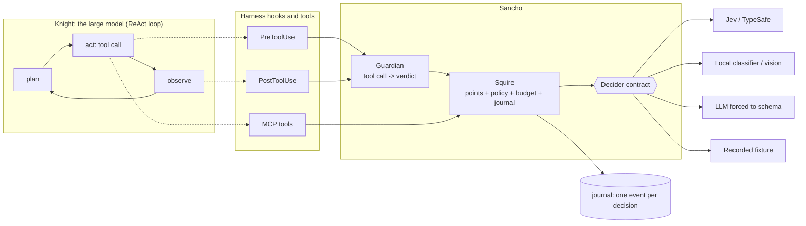

# Sancho

**A calibrated, non-generative decision layer for LLM agent harnesses.**

The knight thinks; the squire reads. An agent built on a large language model takes two
kinds of decisions. The substantive ones (what to investigate, what the evidence means, how
to write it) are what you pay the large model for. The procedural ones (which model size
does this subtask deserve, does this search repeat an earlier one, is this page worth
reading, does this citation support the claim, is this shell command safe, did that
subagent name its sources) happen dozens to hundreds of times per job, get paid at the large
model's price, and leave no trace of why they were taken.

Sancho moves them to a **System One decision model**: one that returns a typed choice, a
scale position or a probability, never text, at a ten-thousandth of a dollar and a quarter
of a second. It attaches to the harness through the hooks and tools the harness already has.
It cannot self-confirm because it cannot write. It returns calibrated probabilities, so code
can abstain or fall back to a default when confidence is low.

```
pip install sanchopanza[jev]       # TypeSafe Jev over HTTP
pip install sanchopanza[mcp]       # expose the decision points as MCP tools
pip install sanchopanza            # core only: recorded, null, local and LLM providers
```

Distribution, import name and command are all `sanchopanza`. `sancho` is installed as a
short alias for the command only; the bare name was taken on PyPI by an unrelated 2014
test framework.

## What it does, measured

Every number below is from the benches in `benches/` and the runs in `docs/paper.md`
(1,371 decision calls, 0.032 USD, September 2026, Jev 1.13.0). Content in Spanish, labels by
one annotator except the 298 register entries with independent labels. Read the intervals.

| Decision point | Agreement | Baseline | Where it sits |
|---|---|---|---|
| Prompt injection in fetched pages | 28/28, AUC 1.00 | regex 23/28 | page triage |
| Citation supports / contradicts / says nothing | 19/20; with numbers 23/24 | Haiku 4.5 19/20 | `verify_citation` tool |
| Unsourced claims in a subagent report | 21/22 | | post-delegation review |
| Search repeats or is keyword-style | 17/18 | | pre-search hook |
| Page worth reading for this purpose | 14/16 | Haiku 15/16 | fetch tool |
| Task complexity (3 levels) | 17/20 raw; 11/11 when acting at conf >= 0.75 | Haiku 8/20 | pre-delegation hook |
| Dangerous shell command | 29/32; with a code deny-list 31/32, 0 false positives (32/32 on the public run) | regex 30/32 | pre-shell hook |
| Same real-world entity | 24/24 | | `align_entities` tool |
| Plan dependency (pairwise) | 20/20; full 8-line DAG: precision 100 %, recall 88 % after code cleanup | | `evaluate_plan` tool |
| Closed-vocabulary classification (10-13 classes) | 80-85 % | majority 43-62 %, keywords 73 % | `classify_field` tool |
| Tool groups a request needs (catalog selection) | not yet measured | | `select_tools`, LangChain middleware |

The result that matters is not accuracy. It is **separation by confidence**: 131 of 132
decisions at confidence >= 0.75 were right; 11 of 24 below. Thirteen of the model's fourteen
errors carried confidence below 0.75. A small LLM's self-reported confidence did not separate
(9 of its 17 errors claimed >= 0.75). That property is what lets an asymmetric policy (act
only when confident, otherwise keep the default) make the agent strictly no worse than
without the squire. Calibration differs by primitive: Truth answers are under-confident,
Score answers are the least reliable. Details in the paper, Section 5.8.

## What it costs

A decision costs **28.7 millionths of a dollar**, output included, because this model's
output is free. The 227 decisions of the public bench cost 0.0065 USD; the same input
tokens priced as Claude Sonnet 5 input alone would be 48 times that, and as Opus 5 input
alone, 119 times. Measured against Claude Haiku 4.5 with tool-forced output on the same
cases: **49x cheaper, three times faster, comparable accuracy** (paper, Section 5.6).

There is **no end-to-end saving percentage here, because that experiment has not been run.**
What can be stated is the break-even, and it is low: at the measured 37 % drop rate, a
fetched page pays for its own triage above **60 tokens** on a Sonnet-class orchestrator, and
a delegated subtask pays for its own routing above **75 tokens**. Real pages and real
subtasks are one to two orders of magnitude larger. The arithmetic, the measured inputs and
the experiment that would license a headline number are in [docs/savings.md](docs/savings.md).

## Architecture



- **Contract** (`sanchopanza.contract`): `Choice`, `Score`, `Truth` questions in; `Answer`s with
  probabilities and confidence out; a `Decider` protocol any provider implements.
- **Points** (`sanchopanza.points`): the questions of each decision point, verbatim as measured,
  and a pure policy function per point. Testable with a table.
- **Squire** (`sanchopanza.squire`): one decider, one `Thresholds`, one journal, one budget.
  Fail-open, capped, traced. High-level methods: `route_task`, `route_search`,
  `triage_page`, `verify_citation`, `evaluate_plan`, `review_report`, `guard_command`,
  `same_entity`, `relate_facts`, `classify`.
- **Guardian** (`sanchopanza.harness.generic`): tool call in, verdict out (allow / deny with
  reason / rewrite arguments). Harness-agnostic.
- **Adapters** (`sanchopanza.harness`): Claude Agent SDK hooks, Claude Code command hook, MCP
  server, OpenAI-Agents-style guardrail.
- **Providers** (`sanchopanza.providers`): `jev`, `recorded`, `null`, `llm`, `local`, plus
  `FallbackDecider` and `RoutedDecider` to mix them.
- **Eval** (`sanchopanza.eval`): bench runner, Wilson / bootstrap / McNemar / AUC / Brier / ECE,
  calibration by primitive, all in plain Python.

## Five-minute start

```python
import asyncio
from sanchopanza import Squire, Thresholds, JsonlJournal
from sanchopanza.providers import create

squire = Squire(
    create("jev"),                                  # reads TYPESAFE_API_KEY
    thresholds=Thresholds(allow_upgrade=False),     # measured defaults
    journal=JsonlJournal("journal.jsonl"),
    brief="Defamation litigation in the Dominican Republic, 2020-2026",
)

async def main():
    routing = await squire.route_task("List the rulings that mention defamation since 2020")
    print(routing.tier, routing.reason)              # light  complexity 0.21 at confidence 0.88

    verdict, confidence = await squire.verify_citation(
        claim="The court ordered a fine of 500,000 pesos.",
        quote="lo condena al pago de una indemnizacion de RD$500.000",
        source="FALLA: declara culpable al imputado ... y lo condena al pago de una "
               "indemnizacion de RD$500.000 a favor del querellante.",
    )
    print(verdict, confidence)                        # supported 0.97

asyncio.run(main())
```

Without a key, `create("null")` makes every method return its default, and
`create("recorded", path="fixtures/public-benches.jsonl")` replays real decisions for free.
The harness works the same either way; that is the point.

## Attach it to a harness

**Claude Agent SDK**

```python
from claude_agent_sdk import ClaudeAgentOptions
from sanchopanza.harness import Guardian, HarnessConfig
from sanchopanza.harness.claude_agent_sdk import hook_matchers

guardian = Guardian(squire, HarnessConfig(
    tiers={"light": "researcher-light", "default": "researcher", "deep": "researcher-deep"},
    cheap_search_available=lambda: True,
    cheap_search_hint="Use mcp__myserver__search",
))
options = ClaudeAgentOptions(hooks=hook_matchers(guardian), ...)
```

**Claude Code** (`.claude/settings.json`), and any harness with the same JSON hook protocol:

```json
{"hooks": {
  "PreToolUse":  [{"matcher": "Agent|WebSearch|Bash", "hooks": [{"type": "command", "command": "sanchopanza hook"}]}],
  "PostToolUse": [{"matcher": "Agent", "hooks": [{"type": "command", "command": "sanchopanza hook"}]}]
}}
```

Configure with `TYPESAFE_API_KEY`, `SANCHO_PROVIDER`, `SANCHO_TIERS`, `SANCHO_JOURNAL`.
See `examples/claude_code/`.

**Any MCP client** (Claude Code, Cursor, Codex, Copilot, Hermes, your own):

```python
from sanchopanza.harness.mcp import build_server
build_server(squire).run()   # tools: verify_citation, evaluate_plan, align_entities, classify_field, triage_text
```

**OpenAI Agents SDK and Codex-style guardrails**: `sanchopanza.harness.openai_agents.tool_guardrail`.
**Anything else**: `Guardian.before_tool(ToolCall(name, args))` returns a `Verdict`; map it.

## Swap the model

The contract is five lines. A provider is one file.

```python
from sanchopanza.providers import LocalDecider, FallbackDecider
from sanchopanza import answers

local = LocalDecider({
    "injection": lambda state, q: answers.truth(my_classifier.predict_proba(state["text"])),
})
squire = Squire(FallbackDecider([local, create("jev")]))   # local answers what it can, Jev the rest
```

`RoutedDecider({"guard": on_prem}, default=hosted)` keeps one decision point on your own
hardware. `LLMDecider(anthropic_completer(...))` or `openai_completer(...)` forces any LLM
into the same schema, with the caveat that its confidence is self-reported. Vision models
plug in through `LocalDecider` with the image reference in the state. Third-party packages
register providers under the `sanchopanza.providers` entry-point group.

## Measure before you trust

```
sanchopanza bench benches/*.jsonl --provider recorded --fixture fixtures/public-benches.jsonl
sanchopanza bench benches/*.jsonl --provider jev --record fixtures/mine.jsonl --out results/today
```

Prints agreement when deciding, coverage, Wilson intervals, latency, agreement by confidence
band, calibration by primitive, and binary AUC / Brier / ECE. The benches are the paper's,
pseudonymized (natural persons renamed; institutions, laws and case numbers kept). Write your
own in the same format; the rule from the paper stands: **a threshold moves when the bench
passes 50 cases per point with a second annotator, and the band table justifies it.**

## What it is not

- Not an arithmetic engine. It does not count or compare numbers; code does that for free.
- Not a security boundary. The decision model is itself vulnerable to instructions injected
  in its state; it only ever *adds* a denial on top of a deterministic list, never an approval.
- Not an explainer. The audit trail is probabilities, not prose.
- Not proven end to end. Everything here is decision-level accuracy. Whether an agent's
  deliverables get cheaper or better is the A/B the paper asks for and has not run.

## Repository

```
src/sanchopanza/            the package
benches/               public benches (core 74, safety 106, graph 64 + one plan)
fixtures/              recorded real decisions: tests and dry runs without a key
docs/paper.md          the working paper, with every number recomputable from results
docs/results/          the public run: results.json, summary.md, provenance.json
docs/savings.md        what it costs, what it keeps out, and the break-even arithmetic
docs/architecture.md   diagrams and the invariants
docs/adapters.md       one page per harness
docs/providers.md      how to write a provider
examples/              Claude Code, Claude Agent SDK, MCP, a local provider
tests/                 no test calls a paid API
```

Apache 2.0, which adds an express patent grant on top of a permissive licence. Named after
the squire who keeps his feet on the ground while the knight sees giants.
