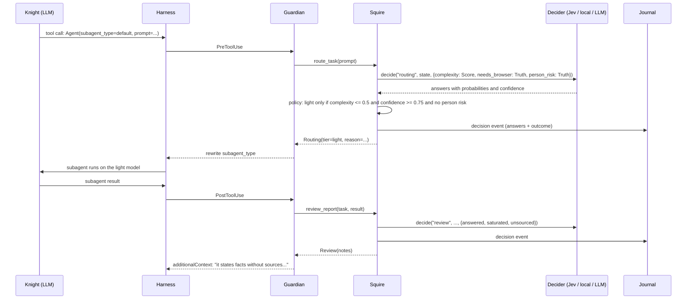
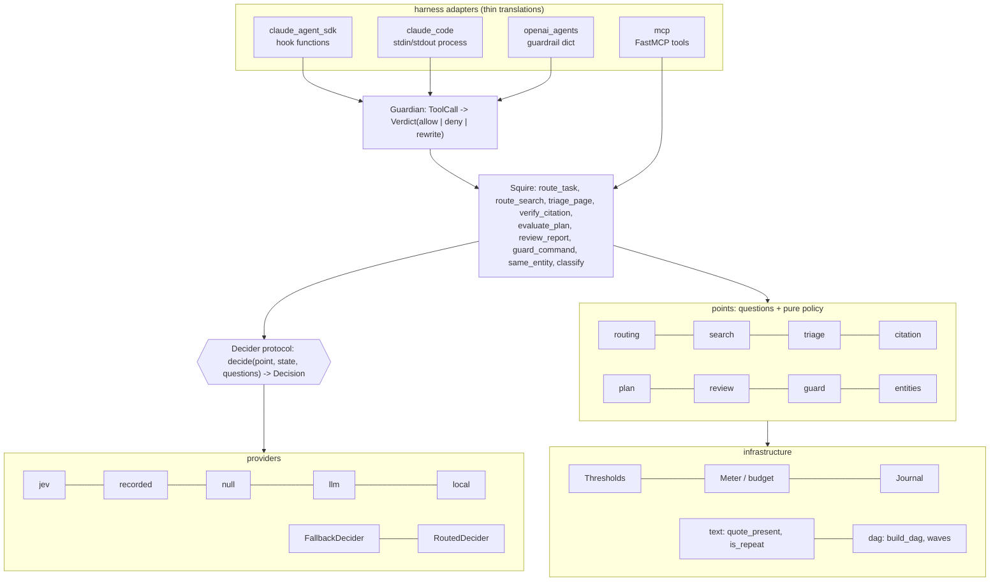

# Architecture

Sancho is a decision layer between an agent harness and a decision model. It owns nothing
of the agent loop. It observes tool calls and tool results through the extension points the
harness already has, asks closed questions about them, and turns calibrated probabilities
into three kinds of effect: rewrite an argument, deny with a reason, or append a note.

## The loop with an evaluator of another family

The classic ReAct loop is *think, act, observe* with one model in all three phases. Sancho
splits *observe* in two: the large model still reads what comes back, but a model of another
family, without the ability to generate and therefore without the ability to self-confirm,
emits typed signals first, about what came back (exhausted, unsourced, off-target) and about
what is about to happen (complexity, redundancy, danger).

## Layers

Dependencies point downwards only. Points import the contract, the policy and text helpers.
The squire imports points. Adapters import the squire. Providers import the contract and
nothing else. Swapping a provider touches one file; adding a harness touches one file.

## Invariants

**Fail-open.** `Squire.decide` never raises. A missing key, an exhausted budget, a network
error, a provider bug: every one becomes a `Decision` with `error` set and no answers, and
every policy maps that to the default the harness had before Sancho existed. The squire can
make an agent cheaper or safer; it cannot make it stop.

**Asymmetry.** The costly direction needs more confidence than the cheap one.

| Decision | Costly direction | Threshold | Cheap direction | Threshold |
|---|---|---|---|---|
| Model per subtask | downgrade to light | `act` = 0.75 | upgrade to deep | `relax` = 0.60, and only if allowed |
| Page triage | drop | relevance < 0.45 or injection > 0.70 | keep | anything else, including no data |
| Citation | emit a verdict | `citation` = 0.80 | send to review | below |
| Shell guard | add a denial | `guard` = 0.70 | leave the code list's answer | always |
| Entity alignment | merge or split | outside [0.25, 0.75] | say "not sure" | inside |
| Classification | accept a label | `classify` = 0.60 | leave null | below, or `other` wins |

The direction follows the cost of the error the operator sees. A router with a bias towards
the cheap model costs quality the client notices; a router that keeps the default costs
cents nobody notices.

**Code before model.** A literal quote match, token overlap between queries, a regex
deny-list, the transitive reduction of a graph: all deterministic, all free, all before any
call. The model covers only what code cannot: synonyms, meaning, indirect danger, pairwise
dependency.

**Trace.** Every decision is one journal event with the raw answers (probabilities,
confidence), cost, latency, provider, model, error, and the policy outcome. It is the audit
trail for "why did this subtask run on the small model" and the labelled set for tuning
thresholds later. Sample it, re-label it, compare.

**Budget.** Decisions and dollars per job. At the cap, defaults and one warning.

## Where the squire does not go

- Arithmetic, dates, magnitude comparisons: the model class reads numbers as text.
- Any action where the decision model would be the only barrier. Its own model card declares
  it vulnerable to instructions injected in its state. In the shell guard it can only deny;
  in page triage the cost of a wrong answer is a token.
- Anything that needs a written explanation. The audit is numbers.

## Calibration by primitive

From the 712 non-repeated decisions of the September 2026 runs (docs/paper.md, 5.8):

| Primitive | n | Agreement | Mean declared confidence | ECE | Reading |
|---|---|---|---|---|---|
| Choice | 392 | 85 % | 0.86 | 0.035 | well calibrated |
| Truth | 182 | 91 % | 0.76 | 0.142 | under-confident: the model is better than it says |
| Truth + Score (routing) | 50 | 76 % | 0.75 | 0.131 | the weakest point, and the only one on a Score |

This is why `Thresholds` has separate knobs rather than one global confidence: a Truth answer
at 0.62 is right about 83 % of the time on the dependency point, and a Score at 0.75 on the
routing point is not. Per-point thresholds were fixed before the runs; they have not been
re-tuned on these numbers. The rule: 50 cases per point and a second annotator first.
