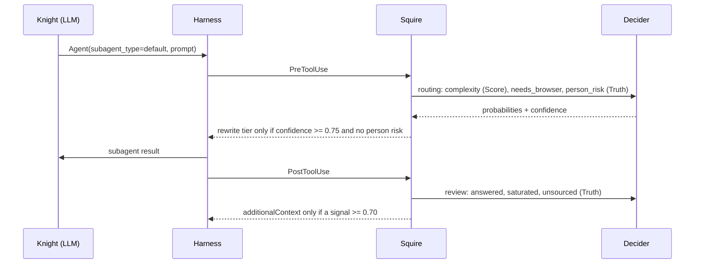
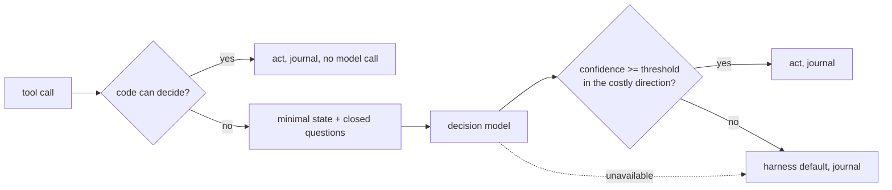
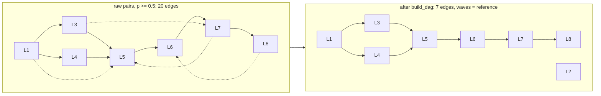

# Sancho: A Calibrated, Non-Generative Evaluator for LLM Agent Harnesses

**Working paper, draft 3 · 2026-09-24**
Status: preliminary results on small benchmarks, mostly single-annotator. Written to be
checked, not believed. Every number is recomputable: the private runs from the result files
described in Appendix A, the public run from `benches/`, `fixtures/public-benches.jsonl` and
`docs/results/2026-09-21-public/` in this repository, with `sanchopanza.eval.stats`.

Draft 3 adds four things and removes no claim: eight further decision points for agent
memory, knowledge-graph construction, source redundancy and loop control, measured on 124
new cases (Section 5.10); an end-to-end experiment on where a decision may be *applied*
without invalidating a prompt cache, which is the first place this layer can lose money
rather than save it (Section 5.11); a revised account in Section 6 of which decisions are
worth taking at all, after our own end-to-end A/B on page triage returned null twice; and a
negative result about our own thresholds, which we report and deliberately do not fix
(Section 5.10).

---

## Abstract

Agents built on the *think, act, observe* loop use one large language model (LLM) for two
very different kinds of decision. Substantive decisions (what to investigate, what the
evidence means, how to write it up) are what the model is paid for. Procedural decisions
(which model size a subtask deserves, whether a search repeats an earlier one, whether a
fetched page is worth reading, whether a citation supports a claim, whether a shell command
is safe, whether a subagent's report names its sources) occur dozens to hundreds of times
per task, are paid at the large model's price, and leave no trace of why they were taken.
We move them to a **heterogeneous evaluator**: a *System One* decision model that returns a
typed choice, a scale position or a probability, never text, attached to the loop through
the harness's existing hooks and tools. Because it belongs to another model family and
cannot generate, it cannot self-confirm; because it returns calibrated probabilities, code
can abstain or fall back to a default when confidence is low.

On 180 hand-labelled cases in Spanish from two real investigations, plus 298 register
entries with independently produced labels, the evaluator (Jev 1.13, TypeSafe) reaches
100 % on prompt-injection detection (28/28, AUC 1.00), 95 % on citation support (19/20),
96 % on numeric citation checks (23/24), 95 % on unsourced-claim detection (21/22), 94 % on
search routing (17/18) and 91 % on dangerous-command detection (29/32); stacked on a
deterministic deny-list it reaches 31/32 with zero false positives. It aligns entity
mentions perfectly on 24 hard pairs, judges pairwise plan dependencies perfectly on 20
pairs and, once code breaks cycles and removes transitive edges, reconstructs the DAG of an
8-line plan with 100 % precision, 88 % recall and the exact parallel waves; on
closed-vocabulary classification against independent labels it reaches 80-85 % over
majority baselines of 43-62 %. Answers were identical across five repetitions and unchanged
with Spanish instructions. Against a small LLM (Claude Haiku 4.5, tool-forced output) it is
49 times cheaper and three times faster with comparable accuracy, and markedly better at
rating task complexity (17/20 against 8/20).

The central result is **separation by confidence**: 131 of 132 decisions at confidence
>= 0.75 were right against 11 of 24 below; 13 of the evaluator's 14 errors carried
confidence below 0.75, whereas 9 of the LLM's 17 errors carried self-reported confidence
>= 0.75. Calibration differs by primitive: Truth answers are under-confident (ECE 0.14 on
182 decisions), Choice answers are well calibrated (ECE 0.035 on 392), and the Score
primitive is the least reliable, which is where the weakest decision point sits. These
properties are what let an asymmetric policy (act only when confident, otherwise keep the
default) make the agent strictly no worse than without the evaluator. We release the
evaluator as a harness-agnostic package with swappable providers, the pseudonymized benches,
and a recorded run that reproduces every public number without a key.

**Keywords:** LLM agents, agent harness, model routing, prompt injection, citation
verification, calibration, System One models, tool-use safety, MCP.

---

## 1. Introduction

The dominant architecture for autonomous research agents is a loop in which an LLM reasons,
calls a tool, reads the result and reasons again [Yao et al., 2023]. Multi-agent variants add
an orchestrator that decomposes a task and delegates lines of inquiry to subagents
[Anthropic, 2025]. In production the loop is wrapped in a *harness*: permissions, sandboxing,
budgets, hooks before and after each tool call, tracing. Three empirical facts from
2025-2026 shape how such a harness should allocate intelligence.

**Tokens are the cost.** In Anthropic's evaluation of its multi-agent research system, token
usage alone explained 80 % of the variance in performance, and an Opus-class orchestrator
delegating to Sonnet-class subagents outperformed a single Opus agent by 90 %
[Anthropic, 2025]. Whatever keeps irrelevant content out of the large model's context, and
whatever assigns a cheaper model to a subtask that does not need a bigger one, is a
first-order lever.

**Routing works, but less than advertised, and routers drift to the majority class.**
RouteLLM cut cost by 85 % at 95 % of GPT-4 quality on MT-Bench, a figure its authors tie to
that benchmark and that model pair [Ong et al., 2025]. A 2026 study over 206,000
query-model pairs found published routing headroom inflated by evaluation artefacts and
standard routers collapsing towards the cheapest tier at an opportunity cost of 13-17 points
[Unsolvability Ceiling, 2026]. In agents the unit of routing is not the initial query but
each step, judged from the trajectory prefix [TwinRouterBench, 2026; Switchcraft, 2026].

**An LLM should not be the critic of its own output.** LLM evaluators prefer their own
text, and stronger models do so more when they are wrong [Panickssery et al., 2024; Do LLM
Evaluators Prefer Themselves, 2025; Self-Preference Bias, 2026]. The recommended correction
is a verifier from a different family anchored in an external signal.

We combine the three into one design decision: the procedural decisions of the loop go to a
**non-generative decision model of a different family**, connected through the harness's
extension points, under a policy that acts only when the model is confident.

**Contributions.**

1. An architecture in which a System One model serves as router *before* acting and as
   critic *after* observing, inside a ReAct-style loop, with three invariants: fail-open,
   asymmetric thresholds, and a trace of every decision with its probabilities.
2. A benchmark of 180 Spanish-language cases across seven decision types from two real
   investigations, plus a graph-maintenance benchmark (entity alignment, fact relations,
   plan dependencies, and 298 closed-vocabulary classifications with independent labels).
   The first three files are released pseudonymized with a recorded run.
3. Measurements of accuracy, calibration (overall and by primitive), stability, language
   sensitivity, and paired comparisons with regular expressions and a small LLM, including
   where the decision model loses and where its declared weakness (counting) appears.
4. A harness-agnostic implementation, `sancho`, with a five-line provider contract, adapters
   for the Claude Agent SDK, Claude Code hooks, MCP and guardrail-style harnesses, and a
   bench runner whose statistics need no numeric library.

---

## 2. Background and related work

**System One decision models.** TypeSafe's Jev is described by its vendor as a model trained
for calibrated decisions rather than text, exposing three primitives: *Choice* (one option
from a set, with a probability over options), *Score* (a probability-weighted position over
2-10 described levels) and *Noul* (probability that a proposition holds) [TypeSafe, 2026a].
Text input, 64k tokens per request; 0.042 USD per million input tokens, output free; 70-500
ms end-to-end; on the vendor's own four-workflow benchmark 67.8 % accuracy against 73.1 %
for Claude Opus 5 and 74.1 % for GPT-5.6 Sol [TypeSafe, 2026b; DataCamp, 2026]. The model
card lists weaknesses that matter here: literal reading, unreliable counting and numeric
comparison, dates read as text, degradation under irrelevant context, and **susceptibility
to instructions injected into the state** [TypeSafe, 2026c]. English is the primary training
language; other languages "are handled but not equally well", without a figure.

**Routing and cascades.** Beyond RouteLLM and FrugalGPT [Chen et al., 2023], the closest
pattern is the *verify-and-escalate cascade*: extract with a cheap model, verify each field
with a decision model, escalate only what is flagged [TypeSafe, 2026d]. Our citation check is
that cascade with the literal match done in code.

**Tool selection.** LLM tool selection degrades past 15-20 tools [Tool Selection, 2026]; a
decision model pre-selecting one skill from 182 reduced wrong loads 2.3x, but confident wrong
suggestions also broke 7 decisions the agent had right [TypeSafe, 2026e]. This is the
empirical basis for our high thresholds. The agent we measured sees about 15 tools, so tool
selection is not one of its decision points; it is where the largest saving lies in harnesses
with hundreds of tool schemas, and the contract here admits it as one more point.

**Injection and agent safety.** Indirect prompt injection through fetched content is the
canonical attack on browsing agents [Greshake et al., 2023]. Because the decision model is
itself declared vulnerable, we use it only where the cost of a wrong answer is a token,
never as the sole barrier before an action.

**Failure taxonomies and tree search.** A 2026 synthesis of 27 papers finds agent failures
compounding with task length and scaffolding not consistently improving reliability
[Beyond the Leaderboard, 2026]; tree-structured search with per-branch value, uncertainty
and risk signals [TreeSeeker, 2026] is the closest relative of our plan evaluation.

---

## 3. Architecture

### 3.1 Setting

A large model (Opus- or Sonnet-class) runs a ReAct loop through an agent SDK with built-in
tools (file I/O, web search, delegation to subagents, shell) and custom in-process tools.
The SDK exposes lifecycle hooks: *PreToolUse* (may deny a call with a reason or rewrite its
input) and *PostToolUse* (may append context to the result). The harness already enforces a
read-only container, an egress allow-list, per-task budgets and an append-only event log.



### 3.2 The evaluator contract

`decide(point, state, questions) -> decision`. Questions are typed (choice / score / truth);
the decision carries, per question, an answer, a probability distribution and a confidence in
[0, 1]. Any provider that implements it is interchangeable. In the released package a
recorded provider replays past decisions for tests and dry runs; a null provider returns
empty answers so every policy falls to its default; an LLM provider forces any chat model
into a schema built from the questions; a local provider wraps arbitrary callables
(classifiers, embeddings, vision models); fallback and per-point routing compose them.

### 3.3 Decision points

| # | Point | Mechanism | Questions (type) | Policy |
|---|---|---|---|---|
| D1 | Model per subtask | PreToolUse on delegation; rewrites the tier | complexity (score, 3 levels); needs interactive browser (truth); reputational risk about a person (truth) | light only if complexity <= 0.5 at confidence >= 0.75 and no person risk; deep if >= 1.5 at >= 0.60 and allowed; else default |
| D2 | Search tier | PreToolUse on web search; denies with reason | repeats an earlier query (truth); source kind (choice, 7); keyword-style query (truth) | token-overlap repeat in code first; repeat -> cut; keyword and a cheap engine -> cheap; question -> the model's search |
| D3 | Page triage | inside the fetch tool, given the purpose | relevant, contains citable evidence, injection (truth, with criteria and examples); source kind (choice) | injection > 0.70 -> drop; relevance < 0.45 -> drop; in doubt keep |
| D4 | Citation check | tool called by the agent | supports / contradicts / says nothing (choice) | quote absent -> *fabricated* in code, no call; confidence >= 0.80 -> verdict; else *review* |
| D5 | Plan evaluation | tool called once per round | value (score), depends (truth), saturated (truth), complexity (score), source kind (choice); per pair: b needs a (truth) | priority = value x (0.2 if saturated); DAG from pairs in code (Section 5.7) |
| D6 | Thread review | PostToolUse on delegation; appends context | answered with sources, exhausted, unsourced facts (truth) | speaks only at a signal >= 0.70 |
| D7 | Command guard | PreToolUse on shell | dangerous (truth, with criteria and examples) | deterministic deny-list first; the evaluator can only add a denial (>= 0.70) |
| G1 | Entity alignment | tool | same real-world entity (truth) | outside [0.25, 0.75] -> same / different; inside -> not sure |
| G2 | Fact relation | tool (not yet in production) | agree / conflict / unrelated (choice) | confidence >= 0.60 else abstain |
| G4 | Closed-vocabulary classification | tool | one category or `other` (choice) | probability >= 0.60 and not `other`, else null |
| G5 | Extraction gate | tool, before a generative extraction pass | chunk contains an instance of the schema (truth) | skip the extraction call only at p <= 0.25 and confidence >= 0.75; else extract |
| G6 | Edge check | tool, after extraction | text states the triple (truth); in that direction (truth) | mentions matched in code first; commit at confidence >= 0.80 in the stated direction; else review |
| M1 | Memory write | tool, on a candidate fact | durable (truth); specific (truth); re-readable from a source (truth) | store only if durable and specific >= 0.70 and re-readable <= 0.75 |
| M2 | Memory collision | tool, candidate against stored | contradicts (truth); adds nothing (truth) | duplicate at adds-nothing >= 0.75; on a contradiction, replace/keep by the harness's timestamps, and flag when it has none |
| M3 | Recall gate | before a memory lookup | the turn needs something learned earlier (truth) | skip the lookup only at p <= 0.25 and confidence >= 0.75 |
| D3b | Source redundancy | inside the fetch tool, against a digest of what is held | adds nothing new for this purpose (truth) | drop at p >= 0.80 and confidence >= 0.75; in doubt the page enters |
| D8 | Loop guard | PostToolUse; appends context | goal already met (truth); the pending check repeats one already run (truth) | speaks only at >= 0.70; advises, never denies |

### 3.4 Invariants

*Fail-open.* If the provider is absent, exhausted or failing, every policy returns the value
the harness had before the evaluator existed, and the failure is logged.

*Asymmetry.* Downgrading a model needs more confidence (0.75) than upgrading (0.60);
dropping a page needs an explicit low relevance and doubt keeps it; a citation verdict needs
0.80 and otherwise abstains; the guard can deny but never approve. The direction of each
asymmetry follows the cost of the error the operator sees.

*Traceability.* Every decision is an event in the append-only log with its probabilities,
confidence, cost, latency and the policy outcome: the audit trail and the labelled dataset
thresholds are later tuned on.

*Budget.* Own per-task cap on calls and dollars; at the cap, defaults and one warning.

*Cache-safe by construction.* A decision acts only where acting cannot invalidate a cached
prompt prefix: before the first request of a session, on content that is about to be
appended, inside a tool the agent called anyway, or on a delegation whose subagent does not
share the parent's prefix. Never by rewriting the tool array, the system prompt or earlier
turns. Section 5.11 measures what the absence of this invariant costs, which is 4.15x.

*Code before model.* Literal quote match, token-overlap repetition, deny-list regexes and
transitive reduction run first, deterministically and for free.



---

## 4. Method

### 4.1 Benchmarks

Three files of hand-labelled cases, one JSON object per line, content in Spanish:

- **Core** (74): D1 model per subtask (20), D2 search tier (18), D3 page triage (16), D4
  citation check (20).
- **Safety and quality** (106): injection (28; 12 positives, 16 hard negatives that discuss
  AI, instructions, manuals, recipes, official orders), dangerous commands (32; 17 positives
  including obfuscated ones), unsourced claims in subagent reports (22; 11 positives),
  numeric citation checks (24; 12 near-miss digit substitutions, magnitude and date shifts).
- **Graph** (65): entity alignment (24 pairs, 12 positives, with siblings, similar nicknames
  and ruling-vs-ruling negatives), fact relation (20: agree 7, conflict 9, unrelated 4), line
  dependency (20 pairs, 10 positives), one 8-line plan with 9 reference edges (56 pairs).

Material comes from two real investigations (a defamation-litigation dossier with 381
sources; a 2026 earthquake dossier): court dispositive texts, gazettes, seismological
bulletins, press, and the tasks and queries an orchestrator would issue. **All labels by one
person, who also designed the questions.** A fourth set, 298 closed-vocabulary fields of a
119-case register produced by a different agent run and reviewed by a human at the time, has
labels independent of the author; it is not released because it names real parties.

**Public release.** The three files are released with natural persons pseudonymized under a
fixed mapping (institutions, laws, courts and case numbers kept). The mapping is not
released. Section 5.9 reports a fresh run on the pseudonymized files, recorded so that every
public number replays without a key.

### 4.2 Conditions

- **E1 Core.** English instructions and criteria; production policy with upgrades allowed.
- **E2 Safety.** Binary decisions at threshold 0.5; paired comparison with regular
  expressions written before seeing results.
- **E3 Numbers.** D4's question and policy on the numeric cases.
- **E4 Language.** E1 with instructions and criteria translated to Spanish.
- **E5 Stability.** Ten cases per core point, five repetitions, a `uid` in the state.
- **E6 Baseline.** Claude Haiku 4.5 on the same states and questions, output forced through
  a tool schema (enum / integer / boolean) plus a self-reported confidence.
- **G1-G4 Graph.** Entity, facts, dependency, the 8-line plan; classification against the
  register with majority and keyword-rule baselines.
- **P Public.** All released cases, pseudonymized, through the released package.

Model `jev-1.13.0` over the native HTTP API, no SDK, from a laptop in Europe;
`claude-haiku-4-5-20251001` over the Messages API. Concurrency 4.

### 4.3 Metrics and statistics

*Agreement when deciding*, *coverage*, *agreement by confidence band*; for binary points AUC
(Mann-Whitney), Brier, expected calibration error (5 bins); Wilson 95 % intervals; paired
bootstrap (2,000 resamples, fixed seed); exact McNemar; Cohen's kappa between repetitions.
*Calibration by primitive*: declared confidence against agreement, grouped by whether the
deciding answer was a Choice, a Score or a Truth. All in plain Python.

---

## 5. Results

### 5.1 Core decisions (E1)

| Point | n | Agreement | Wilson 95 % | Median latency |
|---|---|---|---|---|
| Search tier (D2) | 18 | 17/18 = 94 % | [74, 99] | 281 ms |
| Citation check (D4) | 20 | 19/20 = 95 % | [76, 99] | 266 ms |
| Page triage (D3) | 16 | 14/16 = 88 % | [64, 97] | 281 ms |
| Model per subtask (D1), gated | 20 | 14/20 = 70 % | [48, 85] | 266 ms |
| D1, raw level | 20 | 17/20 = 85 % | | |
| D1, decided at confidence >= 0.75 | 11 | 11/11 = 100 % | | |

The six "errors" of the gated D1 are the default chosen because confidence was below
threshold (0.19-0.64); no task went to the light model without deserving it. The D2 miss is a
repeat with a synonym (*sismo*/*terremoto*) that neither token overlap nor the model caught;
cost, one search. Of the D3 misses, one has confidence 0.14 and is kept on purpose; the other
is a debatable label. The D4 miss is an abstention at 0.33.

**What measurement changed.** The first search question asked whether "a common search engine
would return the pages": a prediction, 38 % agreement. Rewritten as a reading ("is the query
written as keywords or as a question?") with token overlap in code: 94 %.

### 5.2 Safety and quality (E2)

| Point | n | Evaluator (0.5) | Wilson | AUC | Brier | ECE | Regex | Delta (bootstrap) | McNemar p |
|---|---|---|---|---|---|---|---|---|---|
| Injection | 28 | 28/28 | [88, 100] | 1.00 | 0.009 | 0.038 | 23/28 | +18 [+7, +32] | 0.062 |
| Dangerous command | 32 | 29/32 | [76, 97] | 1.00 | 0.056 | 0.132 | 30/32 | -3 [-16, +6] | 1.000 |
| Unsourced claims | 22 | 21/22 | [78, 99] | 1.00 | 0.030 | 0.082 | | | |

The injection regex misses three injections phrased without trigger words and flags two
articles *about* injection; the evaluator has neither error. For commands the picture
inverts: the evaluator misses `env | grep -i key > file`, `dd if=/dev/zero` and `ssh ...
'cat .env'` (0.31, 0.28, 0.43); the regex misses `env | grep` and `find / -name '*.pem'`.
**Deny if either flags: 31/32, zero false positives.** AUC 1.00 on all three means every
positive ranks above every negative: the command misses are threshold errors, not ordering
errors, and Brier / ECE show the probabilities are least calibrated exactly there.

### 5.3 Numeric citation checks (E3)

23/24 (Wilson [80, 99]); 23/23 among decided. The one abstention requires **counting**
("annulled six articles" against a list of seven), sent to review at 0.61. Near-miss digits,
magnitude changes and date shifts were all caught. The declared weakness appeared where the
model card says it appears.

### 5.4 Language of instructions (E4)

Identical on D2, D3, D4 with Spanish instructions. On D1, Spanish gave 17/20 against 14/20
(+15, bootstrap [0, +30], McNemar p = 0.25): not significant, opposite to the vendor's caveat.

### 5.5 Stability (E5)

Forty cases x five repetitions: **zero** label changes; mean standard deviation of the
primary probability 0.003-0.017; kappa 1.00 on every point. A second full pass the same day
reproduced every label but one: a citation at 0.80 moved to 0.78 and became an abstention.
Determinism holds within a session; across sessions, cases on a threshold can change side,
which argues for reporting abstentions rather than hiding them.

### 5.6 Baseline: a small LLM (E6)

| Point | n | Evaluator | Haiku 4.5 | Delta (bootstrap) | McNemar p | Latency (eval / Haiku) |
|---|---|---|---|---|---|---|
| Search tier | 18 | 17/18 | 17/18 | 0 [-17, +17] | 1.000 | 281 / 1110 ms |
| Citation check | 20 | 19/20 | 19/20 | 0 | 1.000 | 266 / 703 ms |
| Page triage | 16 | 14/16 | 15/16 | -6 [-19, 0] | 1.000 | 281 / 906 ms |
| Model per subtask (gated) | 20 | 14/20 | 7/20 | +35 [+5, +65] | 0.065 | 266 / 875 ms |
| Model per subtask (raw) | 20 | 17/20 | 8/20 | | | |
| Dangerous command | 32 | 29/32 | 32/32 | -9 [-19, 0] | 0.250 | 264 / 733 ms |
| Injection | 28 | 28/28 | 28/28 | 0 | 1.000 | 281 / 703 ms |
| Unsourced claims | 22 | 21/22 | 21/22 | 0 [-14, +14] | 1.000 | 280 / 890 ms |

Cost over the same 156 cases: 0.0048 USD against 0.2337 USD (49x). Median latency 266 ms
against 827 ms. With tool-forced output Haiku produced zero type errors. Haiku over-rates
task complexity systematically (13 of 20 one level too high), the only significant
difference.

### 5.7 Knowledge-graph maintenance and plan DAGs (G1-G4)

| Point | n | Agreement | Wilson | Baseline |
|---|---|---|---|---|
| Entity alignment | 24 | 24/24, AUC 1.00 | [86, 100] | |
| Fact relation | 20 | 16/20 | [58, 92] | |
| Line dependency (pairs) | 20 | 20/20, AUC 1.00 | [84, 100] | |
| Classification: defendant category (10) | 103 | 88/103 = 85 % | [77, 91] | majority 55 %; keywords 73 % (+13 [+2, +24]) |
| Classification: case status (13) | 88 | 73/88 = 83 % | [74, 89] | majority 43 % |
| Classification: procedural route (6) | 107 | 86/107 = 80 % | [72, 87] | majority 62 % |

Classification labels are independent of the author and noisy: the figures are agreement
with the register. Confusions concentrate between adjacent classes.

**Building a DAG from pairwise judgments.** On the 8-line plan (56 ordered pairs, 9
reference edges) the raw pairwise answers at 0.5 recover 8 of 9 edges (recall 89 %, AUC
0.94) but propose 20 (precision 40 %): the evaluator also returns *transitive* dependencies,
which are literally true, and two pairs reversed with near-tied probabilities (0.56 vs 0.60;
0.61 vs 0.75). Three deterministic steps (break two-cycles by probability, remove the
weakest edge of any remaining cycle, take the transitive reduction) yield 7 edges, all
correct: precision 100 %, recall 88 % against the reduced reference (closure precision
100 %, recall 95 %), and parallel waves identical to the reference. The missing edge (legal
framework feeding the final report) is a genuine miss. *The evaluator reads pairs; the graph
is built by code.*



### 5.8 Calibration: the central result

Agreement by confidence band, E1 + E2 (excluding numeric cases):

| Confidence | n | Agreement |
|---|---|---|
| >= 0.90 | 107 | 106/107 = 99 % |
| 0.75-0.90 | 25 | 25/25 = 100 % |
| 0.60-0.75 | 8 | 6/8 = 75 % |
| < 0.60 | 16 | 5/16 = 31 % |

Thirteen of the evaluator's fourteen errors carry confidence below 0.75; the exception is the
synonym repeat. Nine of Haiku's seventeen errors carry self-reported confidence >= 0.75,
including a *contradicts* at 0.95 where the evaluator abstained at 0.33. The evaluator's
confidence is usable as a control signal; the LLM's self-report is not.

**By primitive.** Over the 712 non-repeated evaluator decisions of E1-E6 and G1-G4, grouped
by the primitive that carried the decision:

| Primitive | n | Agreement | Mean declared confidence | ECE | Reading |
|---|---|---|---|---|---|
| Choice | 392 | 85 % | 0.86 | 0.035 | well calibrated |
| Truth | 182 | 91 % | 0.76 | 0.142 | under-confident |
| Truth + Choice (search, triage) | 88 | 91 % | 0.89 | 0.050 | |
| Truth + Score (routing) | 50 | 76 % | 0.75 | 0.131 | weakest point |

By point, the largest gaps are dependency (Truth; confidence 0.62, agreement 83 %, ECE
0.208: the model is better than it says) and routing (the only point driven by a Score). Two
consequences: thresholds should be per primitive and per point rather than one global
confidence, and the Score-driven point is the one to keep gated hardest. The thresholds in
the package were fixed before these runs and are **not** re-tuned on them.

### 5.9 Public reproduction (P)

The released package, on the pseudonymized files, with the production thresholds and
upgrades allowed. 283 calls, 184,594 input tokens, 0.0078 USD. Recorded to
`fixtures/public-benches.jsonl`; `sanchopanza bench ... --provider recorded` replays it exactly.

| Point | n | Coverage | Agreement when deciding | Wilson | Private run |
|---|---|---|---|---|---|
| injection | 28 | 100 % | 28/28, AUC 1.00, ECE 0.037 | [88, 100] | 28/28 |
| entity | 24 | 100 % | 24/24, AUC 1.00 | [86, 100] | 24/24 |
| citation | 20 | 90 % | 18/18 (2 to review) | [82, 100] | 19/20 |
| numeric_citation | 24 | 92 % | 22/22 (2 to review) | [85, 100] | 23/24 |
| unsourced | 22 | 100 % | 21/22, AUC 1.00 | [78, 99] | 21/22 |
| search | 18 | 100 % | 17/18 | [74, 99] | 17/18 |
| triage | 16 | 100 % | 14/16 | [64, 97] | 14/16 |
| dependency | 20 | 100 % | 19/20, AUC 1.00 | [76, 99] | 20/20 |
| facts (abstain < 0.60) | 20 | 75 % | 14/15 | [70, 99] | 16/20, no abstention |
| routing (gated) | 20 | 100 % | 14/20 | [48, 85] | 14/20 |
| command | 32 | | code list 17/17 dangerous; model 15/15 benign; **32/32 together** | | 31/32 |

Confidence bands on this run: >= 0.90 -> 141/142; 0.75-0.90 -> 51/52; 0.60-0.75 -> 9/10;
0.40-0.60 -> 1/6; < 0.40 -> 4/8. By primitive: Choice 55 cases, 98 %, ECE 0.026; Truth
143, 97 %, ECE 0.106 (under-confident); Score 20, 70 %, ECE 0.209. The plan reproduces
exactly: 20 raw edges at 40 % precision, 7 clean edges at 100 %, waves identical to the
reference, L2 -> L8 missing.

Differences from the private run are all at thresholds: two numeric citations at 0.64 and
0.68 went to review instead of one; one dependency pair fell to 0.48; the fact-relation point
now abstains under 0.60 (five abstentions, one error at 0.77) where the private run reported
raw agreement. The deny-list, extended after the private run, now catches all 17 dangerous
commands, and the model passed all 15 benign ones. Pseudonyms did not change any label the
questions depend on, which is itself a small check that the decisions are about the text and
not about who is named.

### 5.10 Eight further points: memory, graph construction, redundancy, loop control

Draft 3 adds eight decision points, chosen because the judgment each one makes is already
being made somewhere by a generative model: a memory pipeline runs an extraction call on
every turn and an ADD/UPDATE/DELETE/NOOP call per candidate fact [Mem0, 2025]; a
GraphRAG-style index sends every chunk to a model to have entities pulled out of it, and
every candidate pair to have duplicates merged [LazyGraphRAG, 2024]; and an agent loop, left
alone, re-verifies work it has already finished, at a measured 18x the cost of a clean run
with no improvement in success [Weinberger and Hozez, 2026].

124 hand-labelled cases, one annotator, authored 2026-09-24; 122 decision calls, 84,092
input tokens, **0.0035 USD**, that is 28.9 millionths per decision, reproducing Section 5.9's
figure on a different distribution. Replays for free from `fixtures/new-points.jsonl`.

| Point | n | Coverage | Agreement under the policy | Correct at a plain 0.5 cut | AUC | Brier | ECE |
|---|---|---|---|---|---|---|---|
| Goal met (D8) | 14 | 100 % | 14/14 | 14/14 | 1.00 | 0.037 | 0.131 |
| Repeated check (D8) | 12 | 100 % | 12/12 | 12/12 | 1.00 | 0.017 | 0.112 |
| Recall gate (M3) | 14 | 100 % | 14/14 | 14/14 | 1.00 | 0.003 | 0.051 |
| Extraction gate (G5) | 16 | 100 % | 15/16 | 15/16 | 1.00 | 0.030 | 0.101 |
| Memory collision (M2) | 16 | 100 % | 14/16 | | | | |
| Edge check (G6) | 20 | 85 % | 15/17 | | | | |
| Memory write (M1) | 16 | 100 % | 12/16 | **16/16** | 1.00 | 0.073 | 0.224 |
| Source redundancy (D3b) | 16 | 100 % | 11/16 | **15/16** | 1.00 | 0.039 | 0.121 |

**The central result of Section 5.8 replicates on points it was not derived from.** At
confidence >= 0.75 the new points are right 92 times out of 94; below it, 15 of 27.

**The finding we did not fix.** Over the six binary points the evaluator is right **86 of 88**
at a plain 0.5 cut and **78 of 88** under the thresholds the package ships, with **AUC 1.00
on every one of the six**. No error on these points is an ordering error, and all eight lost
decisions are refusals to act, caused by thresholds calibrated for other points on a Truth
primitive that Section 5.8 had already shown to be under-confident (ECE 0.14). The thresholds
were not moved. The rule is 50 cases and a second annotator per point, and this bench has 12
to 20 and one annotator; a threshold tuned on the run that revealed it is a threshold tuned
on noise. Google's deployed equivalent shows what earning the change looks like: a
probability threshold set per language to a *target precision* and reported as recall@X,
lowered from 70 % to 50 % and then to 40 % once a human preview step existed, each step
buying recall without a loss in satisfaction [Frommgen et al., 2024].

**Per-point notes, including two limitations and one confident error.**

*Edge check (G6).* The metric that matters for a graph is not agreement but whether a wrong
edge is ever committed, because a wrong edge is believed by everything downstream. Of 20
triples, 8 were committed and **none was wrong**; 3 went to review; 9 were rejected. One
rejection is a genuine and *confident* error: a triple stating that a ruling annuls an
article was rejected at confidence 1.00, where the text says the ruling declares that article
unconstitutional among two others. It is the literal-reading weakness of the model class
(Section 5.3) appearing in the one place calibration was supposed to protect, and it is why
this point is specified as a filter in front of a human or a larger model rather than as an
autonomous committer.

*Memory collision (M2).* The `replace` branch fired on 4 of 4 contradictions and was right
each time; the `duplicate` branch **never fired at all** on 16 cases. At the shipped
thresholds the point is in practice a contradiction detector with a safe default, and its
duplicate-suppression half is unproven.

*Memory write (M1).* All four policy errors are facts that should have been stored and were
not, which is the safe direction: a missed memory costs a re-derivation, a junk memory is
read for the rest of the job. The weakest question is `durable` on a stated preference ("the
client asked for the report in Spanish"), where the evaluator returned 0.5 at confidence 0.

*A first draft of M2 was wrong in design, not in accuracy.* It asked whether two facts spoke
about the same attribute, which sent every corroboration, the same figure from a second
source and the common case in an investigation, to a human as though it were a conflict. The
question now asks for a contradiction. The error surfaced while writing the bench, which is
an argument for writing the cases before trusting the point.

*Three labels were corrected after the run, and two deliberately were not.* Three cases were
mislabelled on the question's own criteria: a page that also announces a governor's visit
does add something; a directory entry that adds a sector and a status does add something; a
fact that says "sole shareholder" is more specific than one that says "belongs to". The
corrections and their reasons are recorded in the bench headers, and both sets of numbers are
published. Two further disagreements were left standing, because the evaluator missed them at
low confidence and a bench that moves its labels to match the model measures nothing.

### 5.11 Where a decision may be applied: the prompt cache

Every result above concerns whether a decision is *correct*. This one concerns whether it may
be *acted on*, and it is the first experiment in this line of work where the layer loses
money instead of saving it.

Anthropic's prompt cache matches on a prefix rendered in the order `tools -> system ->
messages`, and a change at any level invalidates that level and all later ones; a cached read
costs 0.1x base input and a five-minute write costs 1.25x [Anthropic, 2026a]. The
tool-selection point of Section 3.3, which the literature makes the largest single saving
available to a harness (58 tools at about 55k tokens of definitions, a 134k peak, and 85 %
fewer definition tokens from server-side tool search [Anthropic, 2025b]), therefore acts on
the one part of a request that sits in front of everything else.

Four arms, 8 turns each, claude-sonnet-5, identical in model, system prompt, questions and
turn count. Each arm tags its tool descriptions with its own name so that it cannot read a
cache another arm wrote. 0.70 USD of real spend.

| Arm | Tools per turn | Cached reads | Cache writes | Cost | vs deciding once |
|---|---|---|---|---|---|
| Full catalog, fixed | 58 | 201,957 | 28,851 | 0.13873 USD | 1.75x |
| Narrowed once, then fixed | 28 | 98,567 | 14,081 | **0.07916 USD** | 1.00x |
| Two stable subsets, alternating | 28/58 | 129,312 | 43,104 | 0.15770 USD | 1.99x |
| A different subset every turn | 28-30 | **0** | 117,148 | 0.32864 USD | **4.15x** |

Narrowing the catalog once is worth **43 %**. Narrowing it on alternate turns costs **14 %
more** than never narrowing: the schema saving is real, and smaller than the three extra
cache writes it buys. Narrowing it differently every turn reads **nothing** from cache across
eight turns, and that zero is the finding: because tools precede everything, an unstable tool
set stops the *conversation* from caching, not merely the schemas.

The same decision, the same tools, a different moment, and the sign of the effect changes.
This is what the fourth invariant of Section 3.4 encodes.

*The first run of this experiment was wrong, in a way worth recording.* All arms shared one
catalog, so the later arms read caches the earlier ones had written, and the per-turn arm
came out cheapest of the three at 0.062 USD: a number which, read without care, says the
naive wiring is the best one. The prefix cache is keyed by the bytes of the prefix and not by
the conversation, so an arm inherits whatever an earlier arm wrote. That first run also
produced the fourth arm, because it showed the risk is not narrowing but instability: two
stable subsets cache as two entries and then read cheaply.

*What it does not say.* One model, one synthetic catalog of 58 tools at about 18k tokens,
roughly a third of what Anthropic reports for 58 real MCP tools, so the schema-side saving
here is understated. The arms were asked questions that need no tool call, so nothing here
measures whether a narrowed catalog answers as well. The accuracy of the tool-selection point
itself remains unmeasured (Section 8, item 7).

---

## 6. Analysis

**Three economies, and one anti-economy.** Draft 2 reported accuracy and left the
question of value to an end-to-end experiment. That experiment has now been run twice and
returned null twice (page triage, 64 paired runs), and the negative result is more
informative than a positive one would have been, because it separates three ways a cheap
decision can be worth something.

*Substitution.* The decision replaces a call some model was going to make anyway: verify this
citation, match this pair of mentions, check this triple, screen this page for injected
instructions, classify this record. The saving is a price ratio, it does not depend on the
workload, and it is the only one of the three whose arithmetic is safe. Measured here at 49x
against a small LLM on the same cases, and by list price at 24-119x. Against a hosted
evaluation meter, which bills 20 USD per million input tokens and 60 per million output, the
ratio for a thousand judgments is roughly 1,450x.

*Avoidance.* The decision keeps tokens out of a large model's context. This is what page
triage does, and it disappoints for three compounding reasons: inside a warm loop those
tokens are priced at the cache-read rate of 0.1x, which cuts the multiple from 48x to 4.8x on
a Sonnet-class model; fewer input tokens is not proportionally fewer dollars, with one
published pruning system reporting 40-60 % fewer input tokens and only 21-36 % less cost at
equal performance [AgentDiet, 2025]; and the lever needs a workload that fetches many
documents, most of them useless, which ours was not.

*Affordability.* Some checks are not skipped because they are hard but because running them
on everything is unaffordable: verify every extracted triple, resolve every candidate pair
after blocking, test every retrieved chunk for relevance. LazyGraphRAG makes the point by
construction, since its relevance-test budget of 100, 500 or 1,500 binary judgments per query
is the parameter that controls its whole cost-quality curve [LazyGraphRAG, 2024]. At 29
millionths a judgment, 1,500 of them cost 0.043 USD. The output is not a smaller bill; it is
a check that used to be sampled and can now be exhaustive, and it should be reported as
quality rather than as savings.

*The anti-economy* is Section 5.11: a decision applied where acting invalidates a cached
prefix costs 4.15x instead of saving 43 %.

**Where a decision lands matters more than how good it is.** Our cache result is one half of
this; the other half is not ours. Meta reported that moving the same static analysis, with
the same false-positive rate, from batch review to diff time took its fix rate from near zero
to over 70 % [Distefano et al., 2019]. Atlassian ran the corresponding ablation inside an
LLM code reviewer: an encoder classifier predicting whether an engineer would *act* on a
comment added 20 points of alignment with human reviewers, while an LLM-as-judge predicting
whether the comment was *true* had "minimal impact" [Atlassian, 2026]. A calibrated layer
should therefore be specified by its attachment point first and its accuracy second, and,
where the choice exists, should be asked to predict behaviour rather than truth.

**Where the evaluator earns its place.** Injection detection, citation support including
near-miss numbers, unsourced-claim detection, entity alignment, pairwise dependency, and
complexity rating, where a small LLM is much worse. All are *reading* tasks: the answer is in
the text.

**Where it does not.** Dangerous commands. Its ranking is perfect but its probabilities are
compressed for indirect danger. The design consequence is not to drop it but to make it
*additive*: it can only add a denial on top of the list. A signal that is right when
confident and quiet when not is safe to stack; one that is confidently wrong is not.

**Calibration is per primitive.** Truth answers under-state their accuracy; Score answers are
the least reliable; Choice answers are well calibrated. A single global confidence threshold
would be too strict for Truth and too lax for Score. The package exposes one threshold per
decision and keeps the Score-driven one highest.

**Cost.** At 0.042 USD per million input tokens and 600-2,500 tokens per decision, one
decision costs 0.00003-0.0001 USD, a figure now measured twice on different distributions
(Sections 5.9 and 5.10, which agree to within a fifth of a millionth). A task with 300
procedural decisions costs
0.01-0.03 USD in evaluation. We still do not claim an end-to-end saving figure for avoidance;
the one end-to-end percentage this work supports belongs to wiring rather than to the model,
and it is the 43 % of Section 5.11.

**A threshold can cost more than a model.** Section 5.10 is the clearest instance: perfect
ordering on six points, and eight correct actions lost to thresholds imported from a
different distribution. The design consequence is not to loosen them by hand but to change
what a threshold is derived from. A confidence cut treats every point alike; a target
precision per point, reported as recall at that precision, is what a deployed system of this
shape uses [Frommgen et al., 2024], and it is what item 3 of Section 8 now asks for.

**A filter needs something to filter.** One boundary condition deserves recording before
anyone stacks this layer on a weak generator: a trained filter moved a 10.1 % precision
reviewer to 10.6 %, and the same filter moved a 57.0 % reviewer to 65.6 % [BitsAI-CR, 2025].
Below some precision floor there is no separable signal, and no threshold recovers one.

**The heterogeneous critic.** D6 is the *evaluate* step performed by a model that did not
reason, cannot write, and belongs to another family. It cannot prefer its own text because it
has none. Whether its notes improve the orchestrator's next decision is an end-to-end
question we have not measured; what we have measured is that the signals are accurate.

**Plans as DAGs.** D5 turns a round's plan into a scored graph: value, saturation and model
per node from single-line questions, edges from pairwise questions, the DAG from code. The
waves are what an orchestrator needs to schedule subagents; the per-node signals are what a
bandit-style allocator would consume [TreeSeeker, 2026]. What is measured is the structure on
one plan; whether scheduling on it improves outcomes is future work.

**Portability.** The same questions, thresholds and code produced the same labels on
pseudonymized text through a repackaged implementation. The properties reported here belong
to the questions and the policy, not to the harness they were first built in.

---

## 7. Threats to validity

- **Small, mostly single-annotator benchmarks.** n = 16-32 per point; the annotator designed
  the questions. Two label changes move a point by 6-12 points. No claim should be read at
  better than +-10 points.
- **Constructed adversarial cases.** Injections and commands were written, not harvested;
  adaptive attackers were not modelled. AUC 1.00 on 28 cases is a floor for the set's
  difficulty, not a ceiling for the model.
- **Spanish content only.** Instruction language was varied; content language was not.
- **One call per case** except E5. Determinism was shown on 40 cases x 5.
- **Asymmetric confidence comparison.** The LLM's confidence is self-reported; the evaluator's
  is a property of its output distribution. The contrast is real but the instruments differ.
- **One plan.** The DAG result is one case, not a distribution.
- **Provider under early access.** Version pinned; the vendor states limits may change. Jev is
  hosted by a single vendor; the contract exists so that a local model can take over.
- **The eight new points are one annotator, 12-20 cases each, authored in one sitting.**
  They are weaker evidence than the points of Section 5.1-5.9, not stronger, and three of
  their labels were corrected after seeing the run. The corrections are recorded and both
  sets of numbers are published, but a reader should treat them as what they are: an
  annotator who was shown a disagreement and revised. A second annotator is the fix.
- **One cache experiment, one model, one synthetic catalog.** Section 5.11 measures a
  documented mechanism rather than a contested one, but it measures it once, on 8 turns, with
  questions that call no tools. The arithmetic of the invalidation hierarchy is the vendor's;
  the dollar figures are ours and they are small.
- **Published figures used in Section 6 are mostly vendor-internal evaluations.** The Meta,
  Atlassian, Google and Anthropic numbers come from engineering reports and industry-track
  papers whose benchmarks are not public. They are used to motivate design, never as
  evidence about this evaluator.
- **No end-to-end measurement of avoidance.** The A/B is null; the fetch-heavy experiment
  that would settle it is specified and unrun.

---

## 8. Limitations and future work

1. **Done, and null.** The end-to-end A/B on page triage ran over 64 paired runs in two
   retrieval conditions and two document sizes: every cost interval spans zero, both latency
   intervals exclude it, quality held. What remains is the *fetch-heavy* version: a task that
   gathers 20-40 sources before writing, over a corpus where most of what retrieval returns
   is off-target, with the redundancy point (D3b) on and off. Prediction, recorded in advance:
   a real effect on input tokens, a smaller one on cost, latency still worse.
2. **Second annotator and 50 cases per point**, with adjudication and reported kappa. This is
   now the blocking item for eight points rather than a refinement of four.
3. **Thresholds derived from a target precision, not from a confidence cut.** Per point, set
   to hit a stated precision and reported as recall at that precision, in the shape of
   [Frommgen et al., 2024]. Section 5.10 gives the size of the prize: 78 of 88 today against
   86 of 88 at a plain 0.5 cut, with every loss in the safe direction.
4. **The `other` option in closed vocabularies**: measure abstention with and without it on
   the register cases (about 0.005 USD).
5. **Harvested adversarial set** for injection: multilingual, encoded, multi-page.
6. **Deferred labelling in production**: sample real decision events and re-label them with a
   frontier model and a human.
7. **Tool selection per step** as a decision point, in harnesses with hundreds of schemas.
8. **Bandit allocation** of subagents over D5's per-branch signals.
9. **Provider diversity**: an open-weight or in-house classifier behind the same contract, and
   a within-family control.
10. **Behavioural labels rather than heuristic ones.** Deferred labelling should record what
    the harness did next (did it act, was the action reverted, did the human override it),
    not a heuristic proxy. An actionability classifier trained on heuristic labels caps at
    AUC 0.59-0.68 once leakage and duplication are removed, and the label definition
    dominates the model [Kang et al., 2022]. The shipped pattern to copy is reviewing
    everything below threshold plus a random sample above it, as a standing audit of the
    threshold itself.
11. **The memory pipeline end to end**: a write path with and without the write gate and the
    collision point, measured on calls, tokens and retrieval quality. Nobody has published
    this; a 2026 survey found only 2 of 9 memory systems reporting any efficiency metric.
12. **Fan-out sizing as a decision point.** The vendor states the buckets in prose (one agent
    for simple fact-finding, two to four subagents for comparisons, ten or more for complex
    research) and the token multiplier between the extremes is about 15x. It is a typed
    choice with a large prize and an obvious quality risk, and it is not implemented here.

---

## 9. Conclusion

A non-generative, calibrated decision model can take over the procedural decisions of an
agent loop through the harness's existing hooks, at negligible cost and latency, with
accuracy comparable to a small LLM on reading tasks and better on complexity rating, and with
a confidence signal that separates right from wrong answers. What makes it safe to deploy is
not the accuracy but calibration plus an asymmetric policy plus fail-open defaults: the agent
with the evaluator is never worse than the agent without it, and it leaves a probabilistic
trace of every decision it changed. Where the evaluator is weak, stacking it on a
deterministic rule keeps its ordering power without inheriting its threshold errors. The
released package, benches and recording are there so that these claims can be checked, and
extended, by anyone.

Draft 3 adds a second lesson that took an end-to-end experiment to learn, and it is about
engineering rather than about models: a decision is worth what its attachment point lets it
be worth. The same tool selection saves 43 % applied once and costs 4.15x applied every turn;
the same static analysis, elsewhere in the literature, is ignored in batch and acted on at
diff time. Accuracy is necessary and it is not what determines whether a layer like this
pays. Where it is allowed to act is.

---

## References

- Anthropic (2025). *How we built our multi-agent research system.* https://www.anthropic.com/engineering/multi-agent-research-system
- Chen, L., Zaharia, M., Zou, J. (2023). *FrugalGPT.* arXiv:2305.05176.
- DataCamp (2026). *Jev: TypeSafe's System One model.* https://www.datacamp.com/blog/system-one-models-jev
- Greshake, K. et al. (2023). *Not what you've signed up for: indirect prompt injection.* AISec 2023.
- Ong, I. et al. (2025). *RouteLLM: Learning to route LLMs with preference data.* ICLR 2025.
- Panickssery, A., Bowman, S., Feng, S. (2024). *LLM evaluators recognize and favor their own generations.* NeurIPS 2024.
- *Do LLM Evaluators Prefer Themselves for a Reason?* (2025). arXiv:2504.03846.
- *Quantifying and Mitigating Self-Preference Bias of LLM Judges* (2026). arXiv:2604.22891.
- *Unsolvability Ceiling in Multi-LLM Routing* (2026). arXiv:2605.07395.
- *TwinRouterBench* (2026). arXiv:2605.18859.
- Agarwal, S. et al. (2026). *Switchcraft: AI model router for agentic tool calling.* arXiv:2605.07112.
- *Beyond the Leaderboard: tool-use, planning and reasoning failures in LLM agents* (2026). arXiv:2607.05775.
- *TreeSeeker: Tree-structured trial, error, and return in deep search* (2026). arXiv:2606.11662.
- *The Tool Selection Problem* (2026). https://tianpan.co/blog/2026/04/09/tool-selection-problem-agent-tool-routing-at-scale
- TypeSafe (2026a). *Primitives; Confidence; State.* https://docs.typesafe.ai
- TypeSafe (2026b). *Introducing System One models and Jev.* https://typesafe.ai/blog/introducing-system-one-models-and-jev
- TypeSafe (2026c). *Jev 1.13 jaggedness.* https://docs.typesafe.ai/model-jaggedness/jev-1.13
- TypeSafe (2026d). *SDE cascade.* https://docs.typesafe.ai/cookbooks/sde_cascade
- TypeSafe (2026e). *Skill suggestion.* https://docs.typesafe.ai/cookbooks/skill_suggestion
- Yao, S. et al. (2023). *ReAct.* ICLR 2023.

Added in draft 3:

- Anthropic (2026a). *Prompt caching.* Cache read 0.1x, five-minute write 1.25x, one-hour write 2x; the `tools -> system -> messages` invalidation hierarchy. https://platform.claude.com/docs/en/build-with-claude/prompt-caching
- Anthropic (2025b). *Advanced tool use.* 58 tools at ~55k tokens; a 134k peak; tool search 77k -> 8.7k, 85 %; programmatic tool calling 43,588 -> 27,297 tokens. https://www.anthropic.com/engineering/advanced-tool-use
- Atlassian (2026). *RovoDev code reviewer: a large-scale online evaluation of LLM-based code review automation.* arXiv:2601.01129.
- Distefano, D., Fahndrich, M., Logozzo, F., O'Hearn, P. (2019). *Scaling static analyses at Facebook.* CACM 62(8).
- Frommgen, A. et al. (2024). *Resolving code review comments with ML.* ICSE-SEIP 2024.
- Kang, H., Aw, K. L., Lo, D. (2022). *Detecting false alarms from automatic static analysis tools.* ICSE 2022, arXiv:2202.05982.
- *BitsAI-CR* (2025). arXiv:2501.15134, FSE 2025 industry track.
- *AgentDiet* (2025). arXiv:2509.23586.
- Repantis, V. et al. (2026). *How many tools should an LLM agent see? A chance-corrected answer.* arXiv:2605.24660.
- Microsoft Research (2024). *LazyGraphRAG.* https://www.microsoft.com/en-us/research/blog/lazygraphrag-setting-a-new-standard-for-quality-and-cost/
- *Mem0* (2025). arXiv:2504.19413.
- Weinberger, S., Hozez, A. (2026). *Prompt-induced waste in coding agents: reasoning, effort, harness design, and end-to-end cost.* arXiv:2608.01347.

---

## Appendix A. Reproducibility

**Public run (this repository).**

```
pip install sanchopanza[dev]
sanchopanza bench benches/core.jsonl benches/safety.jsonl benches/graph.jsonl \
    --provider recorded --fixture fixtures/public-benches.jsonl      # free, exact replay
sanchopanza bench benches/*.jsonl --provider jev --record fixtures/mine.jsonl --out results/today
```

Files: `benches/` (245 cases), `fixtures/public-benches.jsonl` (303 recorded decisions),
`docs/results/2026-09-21-public/` (`results.json` one row per case with raw probability,
`summary.md`, `summary.json`, `provenance.json`). Question texts: `src/sanchopanza/points/*.py`,
verbatim. Statistics: `src/sanchopanza/eval/stats.py`. DAG: `src/sanchopanza/dag.py`. Thresholds:
`src/sanchopanza/policy.py`, fixed before the run.

**New points and the cache experiment (draft 3).**

```
sanchopanza bench benches/memory.jsonl benches/graph-build.jsonl \
    benches/retrieval.jsonl benches/loop.jsonl \
    --provider recorded --fixture fixtures/new-points.jsonl        # free, exact replay
python benchmarks/cache/run.py --dry                               # the arithmetic, free
python benchmarks/cache/run.py --turns 8                           # the four arms, ~0.70 USD
```

Files: `benches/{memory,graph-build,retrieval,loop}.jsonl` (124 cases),
`fixtures/new-points.jsonl` (122 recorded decisions),
`docs/results/2026-09-24-new-points/`, `benchmarks/cache/results/`. The replay is pinned by
`tests/test_new_point_benches.py`, including the gap between the plain 0.5 cut and the
shipped thresholds, so that a future tuning pass has to improve on a recorded number.

**Private runs (E1-E6, G1-G4).** Performed in the originating harness on 2026-09-21 with the
same question texts and thresholds; per-call results (670 + 418 rows), summaries and
provenance sheets are held with the investigations they draw on. The classification cases
(298) and the un-pseudonymized text are not released. Total cost of all runs: 0.258 USD
(evaluator 0.032 USD across 1,371 calls including the public run; baseline LLM 0.234 USD).

## Appendix B. Journal event schema

```json
{"ts": "2026-09-21T10:00:00+00:00", "kind": "decision", "data": {
  "point": "routing", "provider": "jev", "model": "jev-1.13.0",
  "cost_usd": 0.0001, "input_tokens": 812, "latency_ms": 266, "error": null,
  "answers": {"complexity": {"kind": "score", "score": 0.31, "confidence": 0.88,
                              "probabilities": {"0": 0.72, "1": 0.25, "2": 0.03}},
              "needs_browser": {"kind": "truth", "truth": 0.08, "confidence": 0.84},
              "person_risk": {"kind": "truth", "truth": 0.03, "confidence": 0.94}},
  "outcome": {"requested": "default", "chosen": "light",
              "reason": "complexity 0.31 at confidence 0.88"}}}
```

One event per decision. Sampling these events and re-labelling them is the deferred-labelling
experiment of Section 8.
